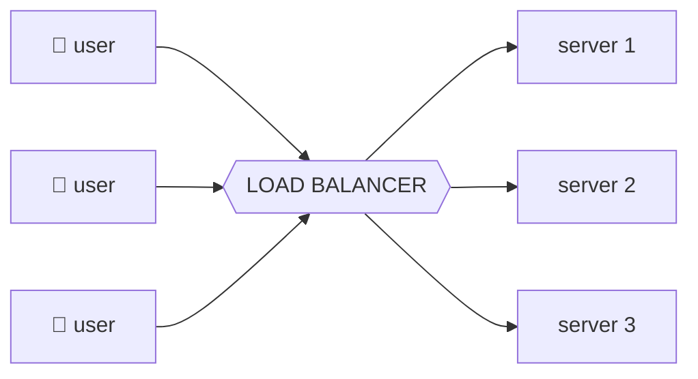
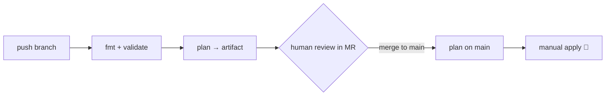

# Cloud School: Load Balancers & Terraform on AWS

**A complete, beginner-friendly engineering course** — how load balancers work, how to build them with Terraform, best practices for data tools (Kafka, NiFi, Zookeeper, ELT & analytics), GitLab CI/CD pipelines, and professional Terraform state management. Every term is explained in plain language, with extra examples, gotchas, and troubleshooting playbooks throughout.

> **How to read this guide — the three signposts:**
> 
> - **💡 Best practice** — the way professionals do it. Copy these habits.
> - **⚠️ Gotcha** — a trap that bites real engineers. Read these twice.
> - **🔧 Fix it** — step-by-step troubleshooting when something breaks.
> 
> Dark blocks are real, runnable code. The 📚 links go to official documentation — bookmark them.

-----

## Table of contents

- [Lesson 1: What is a load balancer?](#lesson-1-what-is-a-load-balancer)
- [Lesson 2: The AWS load balancer family](#lesson-2-the-aws-load-balancer-family)
- [Lesson 3: Building blocks — VPCs, subnets and security groups](#lesson-3-building-blocks--vpcs-subnets-and-security-groups)
- [Lesson 4: What is Terraform?](#lesson-4-what-is-terraform)
- [Lesson 5: Build a real load balancer, step by step](#lesson-5-build-a-real-load-balancer-step-by-step)
- [Lesson 6: Data pipelines — Kafka, Zookeeper, NiFi and analytics](#lesson-6-data-pipelines--kafka-zookeeper-nifi-and-analytics)
- [Lesson 7: GitLab pipelines — robots that ship your code](#lesson-7-gitlab-pipelines--robots-that-ship-your-code)
- [Lesson 8: Terraform state — the save file, and how to split it](#lesson-8-terraform-state--the-save-file-and-how-to-split-it)
- [Lesson 9: Project structure and the golden rules](#lesson-9-project-structure-and-the-golden-rules)
- [Appendix A: Quick troubleshooting index](#appendix-a-quick-troubleshooting-index)
- [Appendix B: Official documentation library](#appendix-b-official-documentation-library)
- [Appendix C: Glossary — every term in plain English](#appendix-c-glossary--every-term-in-plain-english)

-----

## Lesson 1: What is a load balancer?

**Start with a pizza shop.** Imagine a pizza shop with only one cashier. On a quiet Tuesday, one cashier is fine. But on Friday night, fifty hungry people show up at once. The line stretches out the door, people wait forever, and some give up and leave. The cashier is overloaded.

Now imagine the shop hires **three cashiers** and one friendly greeter at the door. The greeter looks at the three lines and sends each new customer to whichever cashier is least busy. Suddenly everyone gets served quickly, no single cashier melts down, and if one cashier goes on break, the greeter simply stops sending people their way.

On the internet, that greeter is a **load balancer**. The cashiers are **servers** — computers that do the actual work, like showing a website or saving your game score. The customers are **requests** — little messages your phone or laptop sends, like “please show me this web page.”



*(The diagram above renders automatically on GitHub and GitLab.)*

### The three jobs of a load balancer

1. **Spread the work (balancing).** It shares incoming requests across many servers so no single server gets crushed. “Load” just means “amount of work,” and “balance” means “share it fairly.”
1. **Check who is healthy (health checks).** Every few seconds it pokes each server and asks, “Are you okay?” If a server stops answering, the load balancer stops sending it customers. Users never even notice a server broke.
1. **Be the one front door.** Users only need to remember one address (one DNS name). Behind that door you can add, remove, or replace servers, and nobody outside has to change anything.

> **💡 Best practice:** the two magic words this enables are **scalable** (add more servers when busy) and **highly available** (survive when one server dies). These two words come up in almost every cloud job interview — and load balancers are how you deliver both.

### How does the greeter actually choose? (Routing algorithms)

The greeter isn’t random — it follows a rule, called a **routing algorithm**:

|Algorithm                     |The rule, in plain English                                                                                   |Where you’ll meet it                            |
|------------------------------|-------------------------------------------------------------------------------------------------------------|------------------------------------------------|
|**Round robin**               |“Next customer → next cashier in the circle: 1, 2, 3, 1, 2, 3…”                                              |ALB default                                     |
|**Least outstanding requests**|“Send the customer to the cashier with the *shortest* line right now.”                                       |ALB optional — great when some requests are slow|
|**Flow hash**                 |“Same customer (same source address + port) always goes to the same cashier, for the life of the connection.”|How NLBs work                                   |
|**Sticky sessions**           |“Once a customer picks a cashier, glue them together using a cookie.”                                        |ALB feature — essential for NiFi (Lesson 6)     |

Switching an ALB to “shortest line” mode is one Terraform line on the target group:

```hcl
resource "aws_lb_target_group" "web" {
  # ... other settings ...
  load_balancing_algorithm_type = "least_outstanding_requests"
}
```

### Vocabulary you’ll see everywhere

|Word                  |Plain-English meaning                                                                                                          |
|----------------------|-------------------------------------------------------------------------------------------------------------------------------|
|**Server**            |A computer whose job is answering requests. The *role*, not special hardware.                                                  |
|**Request / response**|“GET me /scores please” → the page comes back with a status code like `200` (OK) or `404` (not found).                         |
|**IP address**        |A computer’s street address on the network, like `10.0.1.25`. Addresses starting `10.` or `192.168.` are *private*.            |
|**Port**              |A numbered door on that computer (1–65535). Web traffic uses door `80` (HTTP) or `443` (HTTPS). Kafka uses doors around `9092`.|
|**DNS**               |The internet’s phone book — turns `myapp.example.com` into an IP address.                                                      |
|**Traffic**           |The flow of all requests and responses, like cars on a road.                                                                   |


> **⚠️ Gotcha #1 — the load balancer is not magic armor.** It spreads load and survives *server* failures, but if all your servers share one database and *that* dies, everything still dies. Engineers call shared single points “SPOFs” (single points of failure) and hunt them relentlessly.

> **⚠️ Gotcha #2 — never hardcode a load balancer’s IP address.** An ALB’s underlying IPs change whenever AWS feels like it. Always use its **DNS name**. (The exception: NLBs can be given fixed Elastic IPs on purpose — see Lesson 2.)

> **⚠️ Gotcha #3 — your servers see the balancer’s IP, not the user’s.** Behind an ALB, application logs show the ALB’s address as the “client.” The real user IP is in the `X-Forwarded-For` HTTP header — your app must read it from there, or your analytics and rate-limiting will be wrong.

📚 Official docs: [Elastic Load Balancing overview](https://docs.aws.amazon.com/elasticloadbalancing/)

-----

## Lesson 2: The AWS load balancer family

AWS’s load balancer service is **Elastic Load Balancing (ELB)** — “elastic” because it stretches automatically as traffic grows. ELB is a small family, and choosing the right member is your first real engineering decision.

### First, a 60-second idea: network “layers”

Engineers describe networking as a stack of **layers**, like floors in a building (the “OSI model”). Two floors matter here. **Layer 4** is the *envelope* floor: it sees only addresses and ports — *where* a message goes, never what’s inside. **Layer 7** is the *letter* floor: it opens the envelope and reads the actual web request — the URL path, the hostname, the headers. A Layer-7 balancer can make smart decisions like “send `/videos` to the video servers.” A Layer-4 balancer can’t read any of that — but because it does less, it is blazingly fast.

### The family, side by side

|Type                               |Layer                  |Superpower                                                                  |Use it for                                        |
|-----------------------------------|-----------------------|----------------------------------------------------------------------------|--------------------------------------------------|
|**Application Load Balancer (ALB)**|7 — reads the request  |Route by path/host/header, HTTPS, redirects, sticky sessions, WebSockets    |Websites, APIs, microservices, the **NiFi** web UI|
|**Network Load Balancer (NLB)**    |4 — address + port only|Millions of connections, ultra-low delay, raw TCP/UDP, **fixed Elastic IPs**|Databases, game servers, MQTT, **Kafka**-style TCP|
|**Gateway Load Balancer (GWLB)**   |3 — whole packets      |Slipping firewalls / inspection appliances invisibly into the traffic path  |Security appliance fleets (advanced, niche)       |
|**Classic Load Balancer (CLB)**    |4 & 7 (old)            |Nothing new — the retired grandparent                                       |Legacy only. **Never pick for new work.**         |

### A 10-second decision guide

```text
Is the traffic HTTP or HTTPS (web pages, APIs, dashboards)?
 ├── YES → ALB
 └── NO (raw TCP/UDP, custom protocol, extreme speed, need fixed IPs)
      └── NLB
Need to insert a firewall appliance into the path? → GWLB
Found a Classic LB in an old account? → plan its retirement.
```

### Features worth knowing before Lesson 5

- **Cross-zone load balancing.** Should a balancer node in zone A be allowed to send traffic to servers in zone B? On an **ALB it’s always on and free**. On an **NLB it’s off by default**, and turning it on can add inter-zone data charges.
  
  ```hcl
  resource "aws_lb" "tcp" {
    load_balancer_type               = "network"
    enable_cross_zone_load_balancing = true   # NLB: off unless you say so
    # ...
  }
  ```
- **Internal vs. internet-facing.** `internal = true` gives the balancer only private addresses — perfect for the NiFi UI or anything that should never face the public internet.
- **Pricing mental model.** You pay a small hourly fee per balancer plus usage units (AWS calls them **LCUs** — a blend of new connections, active connections, bandwidth, and rule evaluations). Translation for now: a lab ALB costs cents per hour; don’t leave it running for a month by accident.

> **💡 Best practice:** one ALB can front *many* applications using host- and path-based listener rules. Teams often run a single shared ALB per environment instead of one per app — cheaper and tidier.

> **⚠️ Gotcha — NLB + security groups is a one-shot decision.** NLBs only gained security-group support in 2023, and a security group can be associated **only at creation time**. Forget it, and the fix is replacing the NLB. Always create NLBs with a security group attached.

> **⚠️ Gotcha — “the NLB shows the real client IP, the ALB doesn’t.”** Roughly true by default (NLB preserves source IP for most target setups; ALB puts it in `X-Forwarded-For`). Either way: decide *where your app reads the client IP from* before you ship, not after the rate-limiter blocks your own load balancer.

📚 Official docs: [ALB guide](https://docs.aws.amazon.com/elasticloadbalancing/latest/application/introduction.html) · [NLB guide](https://docs.aws.amazon.com/elasticloadbalancing/latest/network/introduction.html)

-----

## Lesson 3: Building blocks — VPCs, subnets and security groups

A load balancer never floats alone. It lives inside a private network you design, surrounded by pieces with intimidating names. Think of AWS as a giant country, and you’re designing one gated neighborhood inside it.

|Piece                     |Friendly picture                       |What it really is                                                                                                                      |
|--------------------------|---------------------------------------|---------------------------------------------------------------------------------------------------------------------------------------|
|**Region**                |A city (e.g. `us-east-1` = N. Virginia)|A geographic cluster of AWS data centers. Pick one near your users.                                                                    |
|**Availability Zone (AZ)**|Separate buildings in that city        |Physically independent data centers with their own power and cooling. **Always spread across ≥ 2** — load balancers require it.        |
|**VPC**                   |Your gated neighborhood                |Your private slice of AWS networking, with an address range in **CIDR** notation like `10.0.0.0/16` (~65,000 addresses).               |
|**Subnet**                |A street, in exactly one AZ            |**Public** subnets have a road to the internet; **private** subnets don’t, so the internet can’t reach them directly.                  |
|**Internet Gateway (IGW)**|The road out of the neighborhood       |Attach it to the VPC; subnets that route `0.0.0.0/0` through it become *public*.                                                       |
|**NAT Gateway**           |A one-way door                         |Lets *private* servers reach out (to download updates) while nothing outside can reach in.                                             |
|**Security Group (SG)**   |A bouncer at each door                 |A stateful mini-firewall per resource: “allow port 443 from anywhere” or, better, “allow port 80 *only from the ALB’s security group*.”|
|**Network ACL (NACL)**    |The neighborhood fence                 |A *stateless* allow/deny list at the subnet edge. Most teams leave it at defaults and do everything with SGs.                          |
|**Listener**              |The receptionist’s instructions        |“Watch port 443 for HTTPS; forward arrivals to the web team.”                                                                          |
|**Target Group**          |The team roster                        |The named set of servers sharing the work, plus the health-check rules for benching sick ones.                                         |

The standard shape, end to end:

```text
internet → Internet Gateway → ALB (public subnets, 2+ AZs)
                                  → target group → servers (PRIVATE subnets)
```

> **💡 Best practice — chain security groups, don’t open ranges.** The ALB’s bouncer admits the internet on 80/443. The servers’ bouncer admits port 80 **only from the ALB’s security group** — no IP ranges at all. Membership, not addresses, defines trust. Lesson 5 writes it exactly this way.

> **💡 Best practice — private by default.** Only load balancers (and NAT gateways) belong in public subnets. Servers, Kafka brokers, NiFi nodes, and databases all live in private subnets. If a thing doesn’t *need* a public IP, it doesn’t get one.

> **⚠️ Gotcha — stateful vs. stateless trips everyone once.** Security groups are *stateful*: allow a request in, and the reply is automatically allowed out. NACLs are *stateless*: you must allow **both directions**, including the high-numbered “ephemeral” reply ports (1024–65535). Symptom of getting this wrong: connections that open but hang forever.

> **⚠️ Gotcha — `0.0.0.0/0` on the wrong rule.** That CIDR means “every address on the internet.” Fine as the *egress* rule or on an ALB’s web ports; a serious incident on a database, Kafka, or SSH port. Code reviews should ctrl-F for it.

> **⚠️ Gotcha — one subnet = one AZ, forever.** You can’t stretch a subnet across zones. High availability means *pairs/triples of subnets*, one per AZ, and that’s why every resource in this course takes a **list** of subnet IDs.

🔧 **Fix it: “I can’t reach my instance at all” — the 60-second checklist**

1. Is it in a **public** subnet with a public IP (or are you coming through the ALB/VPN as intended)?
1. Does the subnet’s **route table** send `0.0.0.0/0` to the IGW (public) or NAT (private-outbound)?
1. Does the **security group** allow your source on that port?
1. Is the **NACL** still default allow-all, or did someone “harden” it?
1. Is the OS firewall / the app actually listening? (`sudo ss -tlnp` on the box.)

📚 Official docs: [Amazon VPC](https://docs.aws.amazon.com/vpc/latest/userguide/what-is-amazon-vpc.html) · [Security groups](https://docs.aws.amazon.com/vpc/latest/userguide/vpc-security-groups.html)

-----

## Lesson 4: What is Terraform?

You *could* build everything from Lesson 3 by clicking around the AWS console. But imagine clicking 40 buttons perfectly, three times, for three environments… and again next month when something changes. Humans forget steps; clicks leave no record. That’s why professionals use **Infrastructure as Code (IaC)**.

**Think of a LEGO set.** Terraform is the instruction booklet for your cloud. You describe the finished build in text files — “one VPC, two subnets, one load balancer, two servers” — and Terraform assembles the real thing in AWS. Same booklet, same build, every time. The booklet lives in **Git**, so every change is reviewed and remembered.

### Five words that unlock all of Terraform

- **HCL** — the language of `.tf` files. Blocks plus `key = value` settings; reads almost like English.
- **Provider** — the plugin that teaches Terraform one platform’s API (`aws`, `gitlab`, even `kafka`).
- **Resource** — one thing you want to exist: one VPC, one load balancer, one security group.
- **State** — Terraform’s memory file recording what it already built. So important it gets Lesson 8.
- **Module** — a reusable folder of Terraform code: a saved LEGO sub-assembly you snap into many builds.

### The commands you’ll type forever

```bash
terraform init       # unbox the kit: download providers, connect state
terraform fmt        # auto-tidy the files
terraform validate   # spell-check the booklet
terraform plan       # PREVIEW: + create, ~ change, - destroy. Touches nothing.
terraform apply      # build it for real
terraform destroy    # tear it all down (your wallet says thanks)
```

> **💡 Best practice — read every plan like a contract.** The scary symbols are `-` (destroy) and `-/+` (destroy *and recreate* — your data on that resource is gone). If a routine change plans a `-/+` you didn’t expect, stop and find out why before applying.

### Two power features (and the trap between them)

**`count` vs `for_each` — the #1 refactoring trap.** Both stamp out copies of a resource. But `count` identifies copies *by position number*, so deleting the **first** item renumbers everything after it — and Terraform “helpfully” destroys and recreates servers that didn’t change:

```hcl
# ⚠️ Risky once the list will ever change:
resource "aws_instance" "web" {
  count = 2                      # web[0], web[1] — positions, not names
  # remove item 0 later → item 1 becomes 0 → REBUILT
}

# ✅ Safe: copies identified by stable names
resource "aws_instance" "web" {
  for_each = toset(["alpha", "bravo"])   # web["alpha"], web["bravo"]
  # remove "alpha" later → "bravo" is untouched
}
```

**`lifecycle` — guard rails on a resource:**

```hcl
resource "aws_lb" "web" {
  # ...
  lifecycle {
    prevent_destroy = true   # plan that would delete this? Hard error.
  }
}
```

> **💡 Best practice — pin everything, commit the lock file.** Pin `required_version` and provider versions (Lesson 5, Step 3), and **commit `.terraform.lock.hcl` to Git** — it freezes exact provider builds so your laptop, your teammate, and the GitLab robot all use byte-identical plugins.

> **⚠️ Gotcha — drift.** Once Terraform manages a resource, console edits create *drift*: reality quietly differs from code. The next `plan` will propose “fixing” the hand edit back, surprising whoever made it. Rule: hand-edit nothing Terraform owns. (Lesson 8 shows how to *adopt* hand-built things properly with `import`.)

> **⚠️ Gotcha — `terraform apply` without a plan file in CI.** Plain `apply` re-plans and auto-applies whatever it computes *now* — which may differ from what was reviewed. In pipelines, always `plan -out=file` then `apply file` (Lesson 7 enforces this).

📚 Official docs: [Terraform intro](https://developer.hashicorp.com/terraform/intro) · [AWS provider](https://registry.terraform.io/providers/hashicorp/aws/latest/docs)

-----

## Lesson 5: Build a real load balancer, step by step

We’ll create a complete mini-system: a VPC, two public subnets (two AZs), two tiny web servers, and an ALB sharing traffic between them — then level it up with HTTPS and smart routing. Destroy it within an hour and the bill is a few cents.

### Step 1 — Install your tools

Terraform CLI + AWS CLI + an AWS account with access keys configured (`aws configure`). Use an IAM user or SSO role — never the root account. Verify:

```bash
terraform -version
aws sts get-caller-identity   # should print your account, not an error
```

### Step 2 — Make a project folder

Terraform merges every `.tf` file in a folder; we split files purely for human sanity:

```text
alb-tutorial/
├── versions.tf    ← which Terraform + providers we need
├── variables.tf   ← knobs we might want to change
├── network.tf     ← VPC, subnets, internet gateway, routes
├── security.tf    ← the bouncers (security groups)
├── servers.tf     ← two tiny web servers
├── alb.tf         ← the star: ALB + target group + listener
└── outputs.tf     ← useful answers printed after apply
```

### Step 3 — Pin your versions (`versions.tf`)

```hcl
terraform {
  required_version = ">= 1.6.0"

  required_providers {
    aws = {
      source  = "hashicorp/aws"
      version = "~> 5.0"   # any 5.x, never a surprise 6.x
    }
  }
}

provider "aws" {
  region = var.aws_region
}
```

### Step 4 — Add your knobs (`variables.tf`)

```hcl
variable "aws_region" {
  description = "Which AWS region to build in"
  type        = string
  default     = "us-east-1"
}

variable "project" {
  description = "Short name stamped on every resource"
  type        = string
  default     = "lb-tutorial"
}
```

### Step 5 — Build the neighborhood (`network.tf`)

One VPC, two public subnets in *different* AZs (the ALB requires ≥ 2), an internet gateway, and a route table saying “to reach the internet, take the gateway.”

```hcl
resource "aws_vpc" "main" {
  cidr_block           = "10.0.0.0/16"
  enable_dns_support   = true
  enable_dns_hostnames = true
  tags = { Name = "${var.project}-vpc" }
}

resource "aws_subnet" "public_a" {
  vpc_id                  = aws_vpc.main.id
  cidr_block              = "10.0.1.0/24"
  availability_zone       = "${var.aws_region}a"
  map_public_ip_on_launch = true
  tags = { Name = "${var.project}-public-a" }
}

resource "aws_subnet" "public_b" {
  vpc_id                  = aws_vpc.main.id
  cidr_block              = "10.0.2.0/24"
  availability_zone       = "${var.aws_region}b"
  map_public_ip_on_launch = true
  tags = { Name = "${var.project}-public-b" }
}

resource "aws_internet_gateway" "igw" {
  vpc_id = aws_vpc.main.id
  tags   = { Name = "${var.project}-igw" }
}

resource "aws_route_table" "public" {
  vpc_id = aws_vpc.main.id
  route {
    cidr_block = "0.0.0.0/0"
    gateway_id = aws_internet_gateway.igw.id
  }
}

resource "aws_route_table_association" "a" {
  subnet_id      = aws_subnet.public_a.id
  route_table_id = aws_route_table.public.id
}

resource "aws_route_table_association" "b" {
  subnet_id      = aws_subnet.public_b.id
  route_table_id = aws_route_table.public.id
}
```

Notice the references: `aws_vpc.main.id` means “the ID of the VPC named *main*, once it exists.” Terraform reads these and figures out the correct build order by itself.

### Step 6 — Hire the bouncers (`security.tf`)

```hcl
# Bouncer #1: the load balancer's front door
resource "aws_security_group" "alb" {
  name_prefix = "${var.project}-alb-"
  description = "Allow web traffic from the internet to the ALB"
  vpc_id      = aws_vpc.main.id

  ingress {
    description = "HTTP from anywhere"
    from_port   = 80
    to_port     = 80
    protocol    = "tcp"
    cidr_blocks = ["0.0.0.0/0"]
  }

  egress {
    from_port   = 0
    to_port     = 0
    protocol    = "-1"
    cidr_blocks = ["0.0.0.0/0"]
  }
}

# Bouncer #2: the servers. Note: NO cidr_blocks on ingress!
resource "aws_security_group" "web" {
  name_prefix = "${var.project}-web-"
  description = "Servers accept traffic ONLY from the ALB"
  vpc_id      = aws_vpc.main.id

  ingress {
    description     = "HTTP, but only from the ALB's security group"
    from_port       = 80
    to_port         = 80
    protocol        = "tcp"
    security_groups = [aws_security_group.alb.id]
  }

  egress {
    from_port   = 0
    to_port     = 0
    protocol    = "-1"
    cidr_blocks = ["0.0.0.0/0"]
  }
}
```

> **💡 Best practice:** `name_prefix` (instead of `name`) lets AWS append random characters, so replacements never collide with the old name — pairs beautifully with `create_before_destroy` below.

### Step 7 — Launch two tiny servers (`servers.tf`)

A startup script installs nginx and writes a page saying *which* server you reached — so you can watch the balancing happen. `count = 2` is fine here because this lab list never changes (remember the Lesson 4 trap for lists that do).

```hcl
data "aws_ami" "amazon_linux" {
  most_recent = true
  owners      = ["amazon"]
  filter {
    name   = "name"
    values = ["al2023-ami-*-x86_64"]
  }
}

resource "aws_instance" "web" {
  count                  = 2
  ami                    = data.aws_ami.amazon_linux.id
  instance_type          = "t3.micro"
  subnet_id              = count.index == 0 ? aws_subnet.public_a.id : aws_subnet.public_b.id
  vpc_security_group_ids = [aws_security_group.web.id]

  user_data = <<-EOT
              #!/bin/bash
              dnf install -y nginx
              echo "<h1>Hello from server ${count.index + 1}!</h1>" > /usr/share/nginx/html/index.html
              systemctl enable --now nginx
              EOT

  tags = { Name = "${var.project}-web-${count.index + 1}" }
}
```

*(Real production: servers in private subnets behind a NAT, launched by an Auto Scaling Group. This lab stays small and cheap on purpose — the ASG upgrade is shown after Step 12.)*

### Step 8 — The star of the show (`alb.tf`, part 1: the load balancer)

```hcl
resource "aws_lb" "web" {
  name               = "${var.project}-alb"   # max 32 characters!
  internal           = false                  # false = faces the internet
  load_balancer_type = "application"
  security_groups    = [aws_security_group.alb.id]
  subnets            = [aws_subnet.public_a.id, aws_subnet.public_b.id]

  enable_deletion_protection = false   # set true in production!

  tags = { Project = var.project }
}
```

### Step 9 — The team roster (`alb.tf`, part 2: target group + members)

Health-check rules in plain English: visit `/` every 30 seconds; two passes in a row = healthy, three fails = benched.

```hcl
resource "aws_lb_target_group" "web" {
  name_prefix = "web-"          # see the rename gotcha below
  port        = 80
  protocol    = "HTTP"
  vpc_id      = aws_vpc.main.id
  target_type = "instance"

  deregistration_delay = 30     # default is 300s — slows every deploy

  health_check {
    path                = "/"
    interval            = 30
    timeout             = 5
    healthy_threshold   = 2
    unhealthy_threshold = 3
    matcher             = "200"
  }

  lifecycle {
    create_before_destroy = true   # build the new one before killing the old
  }
}

# Put both servers on the roster
resource "aws_lb_target_group_attachment" "web" {
  count            = 2
  target_group_arn = aws_lb_target_group.web.arn
  target_id        = aws_instance.web[count.index].id
  port             = 80
}
```

### Step 10 — The receptionist’s instructions (`alb.tf`, part 3: listener)

```hcl
resource "aws_lb_listener" "http" {
  load_balancer_arn = aws_lb.web.arn
  port              = 80
  protocol          = "HTTP"

  default_action {
    type             = "forward"
    target_group_arn = aws_lb_target_group.web.arn
  }
}
```

### Step 11 — Print the address (`outputs.tf`)

```hcl
output "alb_dns_name" {
  description = "Paste this into your browser after apply"
  value       = aws_lb.web.dns_name
}
```

### Step 12 — Build it, test it, tear it down

```bash
terraform init
terraform fmt
terraform validate
terraform plan       # expect roughly "Plan: 14 to add"
terraform apply      # type "yes" — build time ~3 minutes

# Paste the alb_dns_name output into your browser and refresh a
# few times. The page flips between "Hello from server 1!" and
# "Hello from server 2!" — that flip IS load balancing, live.

terraform destroy    # clean up so you stop paying
```

> **💡 Try the magic trick:** before destroying, stop one instance in the console. Wait ~90 seconds (3 failed health checks), refresh: every request now flows to the survivor — zero errors. You just witnessed **high availability**.

### Level up 1 — Real HTTPS with an automatic redirect

```hcl
# A free certificate from AWS Certificate Manager (validated via DNS)
resource "aws_acm_certificate" "web" {
  domain_name       = "app.example.com"
  validation_method = "DNS"
  lifecycle { create_before_destroy = true }
}

# The secure listener
resource "aws_lb_listener" "https" {
  load_balancer_arn = aws_lb.web.arn
  port              = 443
  protocol          = "HTTPS"
  ssl_policy        = "ELBSecurityPolicy-TLS13-1-2-2021-06"
  certificate_arn   = aws_acm_certificate.web.arn

  default_action {
    type             = "forward"
    target_group_arn = aws_lb_target_group.web.arn
  }
}

# Rewrite Step 10's listener: bounce all plain HTTP to HTTPS
resource "aws_lb_listener" "http" {
  load_balancer_arn = aws_lb.web.arn
  port              = 80
  protocol          = "HTTP"

  default_action {
    type = "redirect"
    redirect {
      port        = "443"
      protocol    = "HTTPS"
      status_code = "HTTP_301"
    }
  }
}
```

### Level up 2 — Layer-7 magic: route by path

```hcl
resource "aws_lb_listener_rule" "api" {
  listener_arn = aws_lb_listener.https.arn
  priority     = 10   # lower number = checked first

  action {
    type             = "forward"
    target_group_arn = aws_lb_target_group.api.arn   # a second roster
  }

  condition {
    path_pattern { values = ["/api/*"] }
  }
}
```

### Level up 3 — Access logs (your future debugging flashlight)

```hcl
resource "aws_lb" "web" {
  # ... everything from Step 8 ...
  access_logs {
    bucket  = aws_s3_bucket.lb_logs.id
    enabled = true
  }
}
```

*(The S3 bucket needs a policy allowing the regional ELB log-delivery account to write — copy it from the AWS docs page for ALB access logs.)*

### Level up 4 — Auto Scaling instead of fixed servers

Production replaces Steps 7 + 9’s attachments with a launch template + Auto Scaling Group, which registers and deregisters instances in the target group automatically:

```hcl
resource "aws_autoscaling_group" "web" {
  desired_capacity  = 2
  min_size          = 2
  max_size          = 6
  vpc_zone_identifier = [aws_subnet.public_a.id, aws_subnet.public_b.id]
  target_group_arns = [aws_lb_target_group.web.arn]   # auto-enrollment!
  health_check_type = "ELB"   # trust the ALB's opinion of health

  launch_template {
    id      = aws_launch_template.web.id
    version = "$Latest"
  }
}
```

### ⚠️ Lesson 5 gotchas — the ones that bite on day one

- **32-character name limit.** ALB and target group names over 32 chars fail at apply time. Long `${var.project}-${var.environment}-…` strings hit this constantly — keep names short.
- **Renaming a target group = destroy + recreate**, and the destroy fails while a listener still points at it. The fix is exactly what Step 9 does: `name_prefix` + `create_before_destroy = true`.
- **Security group “DependencyViolation” on destroy.** SGs can’t be deleted while network interfaces (the ALB’s!) still use them. Terraform usually orders it correctly; if you see this, the ALB is still tearing down — wait a minute and re-run `terraform destroy`.
- **Health-checking a redirecting page.** If `/` answers `301` (e.g., your app redirects to `/login`), the default matcher `200` marks everything unhealthy. Either point the check at a real `/health` endpoint or widen the matcher: `matcher = "200,301,302"`.
- **Deregistration delay default = 300 s.** Every deploy waits 5 minutes for connections to “drain” from old instances. `deregistration_delay = 30` is plenty for short web requests.
- **Slow-booting apps get benched at startup.** Java apps that take 90 s to boot fail early health checks and flap. Raise `interval`/`unhealthy_threshold`, or use a target group `slow_start`, or an ASG health-check grace period.

### 🔧 Fix it: the ALB error-code decoder

|You see                              |Who said it|What it means                                                     |Where to look first                                                                                                                                 |
|-------------------------------------|-----------|------------------------------------------------------------------|----------------------------------------------------------------------------------------------------------------------------------------------------|
|**502 Bad Gateway**                  |ALB        |Target answered with garbage or slammed the connection shut       |App crashed mid-request; app’s keep-alive idle timeout is **shorter** than the ALB’s 60 s (make the app’s longer); app returned a malformed response|
|**503 Service Unavailable**          |ALB        |**No healthy targets** to send to                                 |Target group empty? All targets failing health checks? (Run the checklist below)                                                                    |
|**504 Gateway Timeout**              |ALB        |Target took longer than the idle timeout (default 60 s) to respond|Slow query/code path; or the *reply* path is blocked (SG/NACL); raise `idle_timeout` only as a last resort                                          |
|**404 from your app**                |Target     |ALB delivered fine; the app doesn’t know that path                |Listener rules forwarding to the wrong target group; app routing                                                                                    |
|**Connection timeout (no HTTP code)**|Nobody     |Packets never reached the ALB                                     |Wrong DNS name; ALB `internal = true` but you’re outside the VPC; ALB SG missing your port                                                          |

### 🔧 Fix it: “my targets are unhealthy” — the 8-step checklist

1. **Ask AWS why, exactly:**
   
   ```bash
   aws elbv2 describe-target-health \
     --target-group-arn arn:aws:elasticloadbalancing:...:targetgroup/web-.../...
   ```
   
   The `Reason` field (`Target.FailedHealthChecks`, `Target.Timeout`, `Target.ResponseCodeMismatch`…) usually names the culprit outright.
1. **On the instance, is anything listening on the port?** `sudo ss -tlnp | grep :80`
1. **Does the page work locally?** `curl -v http://localhost:80/` — if this fails, it’s an app problem, not a load balancer problem.
1. **Security group:** does the *target’s* SG allow the health-check port **from the ALB’s SG**? (Health checks come from the ALB nodes.)
1. **Matcher mismatch:** does the path return exactly what `matcher` expects? (`curl -i` and read the status code — see the redirect gotcha above.)
1. **NACLs:** if anyone customized them, check both directions including ephemeral ports.
1. **Subnet routing:** are target subnets associated with a route table that can answer back to the ALB?
1. **Timing:** slow app boot? Raise thresholds/`slow_start` rather than fighting symptoms.

📚 Official docs: [aws_lb resource](https://registry.terraform.io/providers/hashicorp/aws/latest/docs/resources/lb) · [Target group health checks](https://docs.aws.amazon.com/elasticloadbalancing/latest/application/target-group-health-checks.html) · [Troubleshoot your ALB](https://docs.aws.amazon.com/elasticloadbalancing/latest/application/load-balancer-troubleshooting.html)

-----

## Lesson 6: Data pipelines — Kafka, Zookeeper, NiFi and analytics

Websites aren’t the only things behind load balancers. Companies also run **data pipelines** — systems moving and cleaning rivers of information: every click, sensor reading, purchase. Picture a water system: **Kafka** is the high-pressure pipes, **NiFi** is the control room where you connect pipes visually, **Zookeeper** is the old supervisor keeping everyone coordinated, and the analytics tools are the labs testing the water at the end.

```text
apps · sensors → Kafka / Kinesis → NiFi / Glue → S3 data lake → Athena · Redshift → dashboards
```

### 6.1 Apache Kafka — the conveyor belt for events

Kafka is a super-fast, replayable conveyor belt for messages called *events* (“player123 scored,” “sensor 7 reads 21 °C”). **Producers** drop events on the belt; **consumers** pick them up — even hours later, because Kafka retains everything for a configurable time. The belt is split into named lanes called **topics**, each chopped into **partitions** so many readers work in parallel. The machines running the belt are **brokers**.

On AWS the best practice is usually **Amazon MSK** (Managed Streaming for Apache Kafka): AWS patches, monitors, and repairs the brokers; you focus on topics and data.

> **💡 Kafka / MSK best practices — memorize these:**
> 
> - **3 brokers across 3 AZs** minimum, replication factor 3, `min.insync.replicas = 2` — one building can burn down with zero data loss.
> - **Private subnets only.** A message backbone should never have a public IP.
> - **Encrypt everywhere:** TLS client↔broker and broker↔broker.
> - **Monitoring + broker logs to CloudWatch** — when a pipeline jams at 2 a.m., logs are your flashlight. Alarm on disk usage and consumer lag.
> - **Security groups reference security groups:** only the app/NiFi SGs may reach the broker ports.

```hcl
resource "aws_cloudwatch_log_group" "msk" {
  name              = "/msk/${var.project}"
  retention_in_days = 30
}

resource "aws_msk_cluster" "events" {
  cluster_name           = "${var.project}-events"
  kafka_version          = "3.6.0"
  number_of_broker_nodes = 3   # must be a multiple of the AZ count

  broker_node_group_info {
    instance_type = "kafka.m5.large"
    client_subnets = [
      aws_subnet.private_a.id,
      aws_subnet.private_b.id,
      aws_subnet.private_c.id,
    ]
    security_groups = [aws_security_group.kafka.id]

    storage_info {
      ebs_storage_info {
        volume_size = 100   # GB per broker — alarm at 80% used
      }
    }
  }

  encryption_info {
    encryption_in_transit {
      client_broker = "TLS"
      in_cluster    = true
    }
  }

  enhanced_monitoring = "PER_TOPIC_PER_BROKER"

  logging_info {
    broker_logs {
      cloudwatch_logs {
        enabled   = true
        log_group = aws_cloudwatch_log_group.msk.name
      }
    }
  }

  tags = { Project = var.project }
}

output "kafka_bootstrap_brokers_tls" {
  value = aws_msk_cluster.events.bootstrap_brokers_tls
}
```

**Know your doors — the MSK port table:**

|Port       |Speaks                 |Notes                                  |
|-----------|-----------------------|---------------------------------------|
|9092       |Plaintext              |Avoid — unencrypted                    |
|**9094**   |**TLS**                |The one you usually want               |
|9096       |SASL/SCRAM             |Username + password auth               |
|9098       |IAM auth               |AWS-native identities                  |
|2181 / 2182|Zookeeper (plain / TLS)|Managed by MSK — clients rarely need it|

And a minimal TLS client config (`client.properties`):

```properties
bootstrap.servers=b-1.events.xxxx.kafka.us-east-1.amazonaws.com:9094,b-2....:9094
security.protocol=SSL
```

> **⚠️ Gotcha — Kafka and load balancers are frenemies.** Kafka clients are clever: they ask any broker “who owns partition 3?” and then connect **directly to that exact broker** (its *advertised listener*). A normal “spread it anywhere” balancer breaks that. Patterns that actually work: **(a)** inside the VPC, just use MSK’s **bootstrap brokers** string — no balancer at all; **(b)** if outside clients must reach *self-managed* Kafka, an internal **NLB** with **one listener + one target group per broker** (9092→broker 1, 9093→broker 2…), with each broker’s `advertised.listeners` set to its NLB address. Knowing this nuance is what separates copy-pasters from engineers.

> **⚠️ Gotcha — broker count must divide evenly by AZ count.** 3 subnets → 3, 6, 9 brokers. Asking MSK for 4 brokers across 3 AZs fails at apply.

> **⚠️ Gotcha — more consumers than partitions = idle consumers.** A topic with 6 partitions feeds at most 6 consumers *in one group*; the 7th sits idle. Plan partition counts for future parallelism (they’re easy to increase, painful to decrease).

🔧 **Fix it: “my client can’t connect to Kafka” — 6 steps**

1. Get the truth from AWS, not from memory:
   
   ```bash
   aws kafka get-bootstrap-brokers --cluster-arn <your-cluster-arn>
   ```
1. Right **port for your auth mode**? (TLS = 9094 — see table.) Mixed port/protocol is the #1 cause.
1. **Security group**: does the broker SG allow the *client’s* SG on that port?
1. **Network path**: client in the same VPC (or peered/VPN with DNS resolution working)? Broker hostnames must resolve: `nslookup b-1....amazonaws.com`.
1. **Raw reachability test** before blaming Kafka:
   
   ```bash
   openssl s_client -connect b-1....amazonaws.com:9094 </dev/null
   ```
   
   Handshake succeeds → network is fine, look at client config.
1. **“LEADER_NOT_AVAILABLE”** spam: topic still being created (wait), or — on self-managed Kafka — `advertised.listeners` points at an address the client can’t reach (the classic).

🔧 **Fix it: consumer lag keeps growing** — confirm with MSK’s `MaxOffsetLag` metric → 1) processing too slow? profile the consumer; 2) too few consumers? scale out *up to* the partition count; 3) too few partitions? increase them (new keys re-hash — coordinate with the team); 4) one “poison” message crash-looping a consumer? add a dead-letter topic.

### 6.2 Zookeeper — the referee (now retiring)

**Apache Zookeeper** is a small coordination service — a referee that distributed systems use to agree on facts: who is the leader, what config is current, who is alive. Classic Kafka couldn’t start without it.

Modern reality, in two facts: **(1)** new Kafka uses built-in **KRaft** mode instead (Kafka 4.x dropped Zookeeper entirely; with MSK, AWS manages the coordination layer for you either way). **(2)** Zookeeper still matters because other tools — notably a **NiFi cluster** — use it as their referee.

> **💡 If you must run Zookeeper:** always an **odd number** of nodes (3 or 5 — votes can’t tie), one per AZ, private subnets, stable storage, and a self-referencing security group so the ensemble can gossip (ports 2181 client, 2888 peer, 3888 elections).

> **⚠️ Gotcha — 2 nodes is worse than 1.** Quorum needs a majority: with 2 nodes, losing either one halts everything. Even numbers add cost *and* fragility.

🔧 **Fix it: is Zookeeper alive?** `echo ruok | nc zk-host 2181` should answer `imok`. No answer → either ZK is down, the SG blocks 2181, or the `ruok` command isn’t whitelisted (`4lw.commands.whitelist` in config — itself a common gotcha). For NiFi-related issues, also check ZK from *each NiFi node*, not just your laptop.

### 6.3 Apache NiFi — pipelines you can *see*

**NiFi** lets you build pipelines by dragging boxes on a canvas: “watch this folder → convert to JSON → publish to Kafka,” with live back-pressure and full *provenance* (a record of where every piece of data went). A NiFi **cluster** is several nodes acting as one (coordinated by Zookeeper), and its web screen is exactly what an **ALB** was born for — with one special trick: **sticky sessions**, so after you log in on node 2, every next click also lands on node 2.

```hcl
resource "aws_lb_target_group" "nifi_ui" {
  name_prefix = "nifi-"
  port        = 8443
  protocol    = "HTTPS"        # NiFi itself speaks HTTPS
  vpc_id      = aws_vpc.main.id
  target_type = "instance"

  # THE key setting: same person → same NiFi node, all day
  stickiness {
    type            = "lb_cookie"
    cookie_duration = 86400    # 24 hours
    enabled         = true
  }

  health_check {
    path     = "/nifi/"
    protocol = "HTTPS"
    matcher  = "200,302"       # a login redirect still means "alive"
  }

  lifecycle { create_before_destroy = true }
}

# Cluster nodes must gossip freely among THEMSELVES:
resource "aws_security_group_rule" "nifi_internal" {
  type                     = "ingress"
  from_port                = 0
  to_port                  = 65535
  protocol                 = "tcp"
  security_group_id        = aws_security_group.nifi.id
  source_security_group_id = aws_security_group.nifi.id   # self-reference!
  description              = "NiFi cluster-internal traffic"
}
```

> **💡 NiFi best practices:** nodes in **private subnets**; the ALB **`internal = true`** (a pipeline control room does not belong on the public internet — reach it via VPN/office network); an **external 3-node Zookeeper** for production clusters, not NiFi’s embedded one; **fast disks** — the flowfile/content/provenance repositories are disk-hungry, ideally on separate volumes.

> **⚠️ Gotcha — “NiFi keeps logging me out!”** That’s missing stickiness, every time. Each click lands on a different node, which doesn’t know your session. Enable `lb_cookie` stickiness (above) and route all UI traffic through one target group.

> **⚠️ Gotcha — clock skew breaks clusters.** NiFi (and Zookeeper, and Kafka) coordination assumes node clocks agree. Amazon Linux runs chrony by default — don’t disable it; “node randomly disconnects” with TLS or session errors is often just drifted time.

🔧 **Fix it: “node disconnected from cluster”** — 1) on the sad node, `nifi-app.log` names the reason; 2) test Zookeeper from that node (`echo ruok | nc zk 2181`); 3) confirm the self-referencing SG rule exists so cluster-protocol ports are open node↔node; 4) check clock skew (`chronyc tracking`); 5) disk full? NiFi pauses when repositories fill — check back-pressure indicators on the canvas and free space.

🔧 **Fix it: data stuck / queues red (back pressure)** — back pressure is a *feature*: a downstream processor is slower than upstream. Find the first red connection, look one step *after* it, and fix or scale that processor; raising queue thresholds just hides the jam.

### 6.4 ETL vs. ELT, and the analytics shelf

Both acronyms mean Extract (collect), Transform (clean/reshape), Load (store for analysis) — only the order differs. **ETL**: clean first, then store. **ELT** (the modern favorite): dump raw data into cheap storage first, transform later inside a powerful warehouse — like keeping all your raw photos and editing copies whenever a new question comes up.

The AWS shelf in one breath: **Kinesis** (AWS-native streaming, Kafka’s serverless cousin), **S3** as the data lake (the giant raw-files bucket), **Glue** (serverless Spark jobs + a catalog that is the lake’s index), **Athena** (SQL questions directly against S3 files, pay per query), **Redshift** (the heavy-duty warehouse behind dashboards), **EMR** (rent-a-Spark-cluster for big custom jobs).

> **💡 Data-lake best practices:** store **Parquet** (columnar) instead of raw CSV/JSON; **partition by date** (`s3://lake/events/dt=2026-06-10/...`); add S3 lifecycle rules to archive cold data; tag and encrypt everything; one Terraform module per service, one state per component (next lessons).

> **⚠️ Gotcha — Athena bills per byte *scanned*.** `SELECT *` over an unpartitioned CSV lake reads everything, every query. Partitioning + Parquet routinely cuts scans by 100×. Set per-workgroup scan limits so an innocent query can’t cost real money.

> **⚠️ Gotcha — Glue crawlers guess.** Point a crawler at messy folders and it may invent one weird table per file or mis-type columns. Keep folder layout consistent, and pin schemas for tables that matter.

📚 Official docs: [Kafka](https://kafka.apache.org/documentation/) · [Amazon MSK](https://docs.aws.amazon.com/msk/latest/developerguide/what-is-msk.html) · [Zookeeper](https://zookeeper.apache.org/) · [NiFi](https://nifi.apache.org/documentation/) · [What is ETL](https://aws.amazon.com/what-is/etl/)

-----

## Lesson 7: GitLab pipelines — robots that ship your code

Running `terraform apply` from your laptop is fine for learning, dangerous for a team: whose laptop? with whose keys? did anyone review it? The professional answer is **CI/CD** — an assembly line of robots that checks, previews, and (only after human approval) applies every change. In GitLab the line is one file at the repo root, `.gitlab-ci.yml`; the robots executing it are **runners**.

### The safe workflow, as a story

1. You create a **branch** and change `alb.tf`.
1. You open a **Merge Request (MR)** — “please review my change.”
1. The robot runs `fmt`, `validate`, and `plan`, and shows the plan in the MR.
1. A teammate reads it (“creates 1 listener, destroys nothing — approved ✅”).
1. You merge to `main`. The robot plans again, then **waits at a manual `apply` button**. A human clicks. Terraform applies *the exact saved plan file*.



### A clean starter pipeline

```yaml
image:
  name: hashicorp/terraform:1.9
  entrypoint: [""]

variables:
  TF_ROOT: ${CI_PROJECT_DIR}/envs/dev
  TF_IN_AUTOMATION: "true"

cache:
  key: "${CI_COMMIT_REF_SLUG}-dev"
  paths:
    - ${TF_ROOT}/.terraform

stages:
  - validate
  - plan
  - apply

before_script:
  - cd ${TF_ROOT}
  - terraform init -input=false

fmt:
  stage: validate
  script:
    - terraform fmt -check -recursive   # fail if files are messy

validate:
  stage: validate
  script:
    - terraform validate

plan:
  stage: plan
  script:
    - terraform plan -input=false -out=plan.tfplan
  artifacts:                 # hand the plan to the apply job
    paths:
      - ${TF_ROOT}/plan.tfplan
    expire_in: 7 days

apply:
  stage: apply
  script:
    - terraform apply -input=false plan.tfplan   # apply EXACTLY that plan
  when: manual               # a human must press the button
  rules:
    - if: $CI_COMMIT_BRANCH == "main"
  environment:
    name: dev
  resource_group: tf-dev     # ← never two applies at once (see gotchas)
```

Three details make this professional: the plan is a saved **artifact** consumed verbatim by apply; apply is `when: manual`; apply runs only from `main`. Your AWS keys never appear in the file — store them as **masked, protected CI/CD variables**, or better:

> **💡 Best practice — no long-lived keys at all (OIDC).** GitLab can mint a short-lived identity token per job; AWS trusts it and hands back temporary credentials. Nothing to leak, nothing to rotate:
> 
> ```yaml
> .aws_auth:
>   id_tokens:
>     GITLAB_OIDC_TOKEN:
>       aud: https://gitlab.com
>   before_script:
>     - >
>       CREDS=$(aws sts assume-role-with-web-identity
>       --role-arn "$AWS_ROLE_ARN"
>       --role-session-name "gitlab-${CI_PIPELINE_ID}"
>       --web-identity-token "$GITLAB_OIDC_TOKEN"
>       --duration-seconds 3600
>       --query 'Credentials.[AccessKeyId,SecretAccessKey,SessionToken]'
>       --output text)
>     - export AWS_ACCESS_KEY_ID=$(echo $CREDS | cut -f1)
>     - export AWS_SECRET_ACCESS_KEY=$(echo $CREDS | cut -f2)
>     - export AWS_SESSION_TOKEN=$(echo $CREDS | cut -f3)
> ```
> 
> *(One-time setup: an OIDC identity provider + IAM role trust policy in AWS — see the GitLab docs link below for the exact JSON.)*

### Scaling up: many services, many environments

Two GitLab features keep a multi-component repo tidy: a hidden **template job** (names starting with a dot don’t run by themselves) and `rules: changes`, so each component’s jobs run *only when its own folder changed*:

```yaml
stages: [validate, plan, apply]

.tf-component:
  image:
    name: hashicorp/terraform:1.9
    entrypoint: [""]
  before_script:
    - cd ${TF_ROOT}
    - terraform init -input=false

plan:network:
  extends: .tf-component
  stage: plan
  variables: { TF_ROOT: envs/dev/network }
  script: [ "terraform plan -out=plan.tfplan" ]
  artifacts: { paths: ["envs/dev/network/plan.tfplan"] }
  rules:
    - changes: ["envs/dev/network/**", "modules/network/**"]

plan:kafka:
  extends: .tf-component
  stage: plan
  variables: { TF_ROOT: envs/dev/kafka }
  script: [ "terraform plan -out=plan.tfplan" ]
  artifacts: { paths: ["envs/dev/kafka/plan.tfplan"] }
  rules:
    - changes: ["envs/dev/kafka/**", "modules/kafka/**"]

apply:kafka:
  extends: .tf-component
  stage: apply
  variables: { TF_ROOT: envs/dev/kafka }
  script: [ "terraform apply plan.tfplan" ]
  needs: ["plan:kafka"]
  when: manual
  resource_group: tf-dev-kafka
  rules:
    - if: $CI_COMMIT_BRANCH == "main"
      changes: ["envs/dev/kafka/**", "modules/kafka/**"]
  environment: { name: dev/kafka }
```

> **💡 More best practices for the pipeline:**
> 
> - **Protect prod** (Settings → CI/CD → Protected environments): only senior approvers may press its apply button. Promote dev → staging → prod with the same code and increasing ceremony.
> - Add **`tflint`** (catches AWS-specific mistakes `validate` can’t) and a security scanner (**checkov** or **trivy**) to the validate stage.
> - `resource_group` on every apply job — GitLab queues applies to the same group instead of running them concurrently, which prevents most state-lock collisions before they happen.

> **⚠️ Gotcha — protected variables vanish on unprotected branches.** Mark your AWS credentials “protected,” and feature-branch pipelines silently get empty values — `init` fails with baffling auth errors. Either protect the branches that need them or rely on MR pipelines from protected sources. This one wastes hours regularly.

> **⚠️ Gotcha — cache ≠ artifact.** `cache` is a best-effort speed-up (the `.terraform` providers dir); `artifacts` are guaranteed hand-offs between jobs (the plan file). Put the plan in cache and your apply will someday run on a runner where the cache is cold — and apply *nothing* or re-plan blind.

> **⚠️ Gotcha — “Saved plan is stale.”** If the state changed between `plan` and your click on `apply` (someone else applied first), Terraform refuses the old plan. That’s a safety feature: re-run the pipeline to get a fresh plan. `resource_group` + applying promptly keeps this rare.

🔧 **Fix it: pipeline fails at `terraform init`** — 1) read the first error line: *backend* (state) or *registry* (providers)? 2) backend/S3: are credentials present in this context (see protected-variables gotcha) and does the role have S3 + DynamoDB rights? 3) GitLab-managed state: is `TF_HTTP_PASSWORD`/`CI_JOB_TOKEN` wiring intact (Lesson 8)? 4) registry timeouts: add a retry, or mirror providers for air-gapped runners.

🔧 **Fix it: apply job can’t find `plan.tfplan`** — the artifact path must match `TF_ROOT` exactly (artifacts are relative to the project dir, not the job’s `cd`); the apply job needs `needs:` or same-stage ordering so it downloads the artifact; check the plan job’s `expire_in` hasn’t passed.

📚 Official docs: [GitLab CI/CD](https://docs.gitlab.com/ee/ci/) · [GitLab ↔ AWS OIDC](https://docs.gitlab.com/ee/ci/cloud_services/aws/) · [Infrastructure as Code in GitLab](https://docs.gitlab.com/ee/user/infrastructure/iac/)

-----

## Lesson 8: Terraform state — the save file, and how to split it

**Terraform state** is a video-game save file: a JSON document recording every resource Terraform built and its real-world ID. On every `plan`, Terraform compares three things — your **code** (what you want), the **state** (what it remembers), and **AWS** (what exists) — and computes the difference. Lose the save file, and Terraform forgets it ever built anything; the next apply tries to build duplicates of your world.

### Rule 1 — never keep state on a laptop (or in Git)

Local `terraform.tfstate` has three fatal problems: teammates can’t see it, it can contain **secrets** (so it must never be committed), and two people applying at once corrupt it. The fix is a **remote backend** with **locking** — a “recording in progress” light that makes everyone else wait.

**Classic AWS backend — S3 + DynamoDB lock:**

```hcl
terraform {
  backend "s3" {
    bucket         = "mycompany-terraform-state"      # one shared bucket
    key            = "dev/network/terraform.tfstate"  # UNIQUE per component!
    region         = "us-east-1"
    dynamodb_table = "terraform-locks"
    encrypt        = true
  }
}
```

**The one-time bootstrap** (a tiny project applied once with local state, just to create the home where all other state will live):

```hcl
resource "aws_s3_bucket" "tf_state" {
  bucket = "mycompany-terraform-state"
}

resource "aws_s3_bucket_versioning" "tf_state" {
  bucket = aws_s3_bucket.tf_state.id
  versioning_configuration {
    status = "Enabled"          # versioning = your undo button
  }
}

resource "aws_s3_bucket_server_side_encryption_configuration" "tf_state" {
  bucket = aws_s3_bucket.tf_state.id
  rule {
    apply_server_side_encryption_by_default {
      sse_algorithm = "aws:kms"
    }
  }
}

resource "aws_s3_bucket_public_access_block" "tf_state" {
  bucket                  = aws_s3_bucket.tf_state.id
  block_public_acls       = true
  block_public_policy     = true
  ignore_public_acls      = true
  restrict_public_buckets = true
}

resource "aws_dynamodb_table" "tf_locks" {
  name         = "terraform-locks"
  billing_mode = "PAY_PER_REQUEST"
  hash_key     = "LockID"
  attribute {
    name = "LockID"
    type = "S"
  }
}
```

**Two modern alternatives, so nothing surprises you:**

- **S3-native locking (Terraform ≥ 1.10):** add `use_lockfile = true` to the S3 backend and skip DynamoDB on new projects.
- **GitLab-managed state:** state stored, versioned, and locked inside your GitLab project — zero AWS setup, plans visible in MRs. The code says only `backend "http" {}`; CI supplies the rest:
  
  ```hcl
  terraform {
    backend "http" {}
  }
  ```
  
  ```bash
  # in the CI job (one state per component: note the name at the end)
  terraform init \
    -backend-config="address=${CI_API_V4_URL}/projects/${CI_PROJECT_ID}/terraform/state/dev-network" \
    -backend-config="lock_address=${CI_API_V4_URL}/projects/${CI_PROJECT_ID}/terraform/state/dev-network/lock" \
    -backend-config="unlock_address=${CI_API_V4_URL}/projects/${CI_PROJECT_ID}/terraform/state/dev-network/lock" \
    -backend-config="username=gitlab-ci-token" \
    -backend-config="password=${CI_JOB_TOKEN}" \
    -backend-config="lock_method=POST" \
    -backend-config="unlock_method=DELETE" \
    -backend-config="retry_wait_min=5"
  ```

### Rule 2 — many small states, never one giant one

One mega-state means slow plans, one team-wide lock, and a mistake in NiFi code that can propose destroying the network. Split by **environment × component**, each with its own backend `key`. The damage any mistake can cause — the **blast radius** — shrinks to one small folder.

|Component folder  |Backend key (its own save file)|Changes how often?      |
|------------------|-------------------------------|------------------------|
|`envs/dev/network`|`dev/network/terraform.tfstate`|Rarely — the foundation |
|`envs/dev/alb`    |`dev/alb/terraform.tfstate`    |Sometimes               |
|`envs/dev/kafka`  |`dev/kafka/terraform.tfstate`  |Sometimes               |
|`envs/dev/nifi`   |`dev/nifi/terraform.tfstate`   |Often — pipelines evolve|
|`envs/prod/…`     |`prod/…/terraform.tfstate`     |Only via reviewed MRs   |

### Rule 3 — let components read each other’s outputs

Split states still cooperate: Kafka must know the VPC ID the network component created. The clean bridge is the **`terraform_remote_state`** data source — read-only access to another component’s **outputs** (only outputs are exposed; that’s the point):

```hcl
data "terraform_remote_state" "network" {
  backend = "s3"
  config = {
    bucket = "mycompany-terraform-state"
    key    = "dev/network/terraform.tfstate"
    region = "us-east-1"
  }
}

# then:
#   vpc_id  = data.terraform_remote_state.network.outputs.vpc_id
#   subnets = data.terraform_remote_state.network.outputs.private_subnet_ids
```

> **💡 Looser-coupling alternative for big orgs:** the network component *writes* its outputs to SSM Parameter Store; consumers read parameters instead of each other’s state. Components stop needing read access to one another’s state files entirely.

### Adding a brand-new service later (say, Redshift) — the 5-step ritual

1. Create `modules/redshift/` (reusable code) and `envs/dev/redshift/` (this environment’s copy).
1. Give it its **own backend key**: `dev/redshift/terraform.tfstate`. Existing states untouched — zero risk to what runs.
1. Pull the VPC/subnets it needs via `terraform_remote_state`.
1. Add `plan:redshift` / `apply:redshift` jobs with `rules: changes` (Lesson 7).
1. MR → robot plan → review → merge → manual apply in dev → staging → prod. Same dance, every time.

### State surgery — handle with gloves

```hcl
# Renamed a resource in code? Tell Terraform it MOVED, don't let it rebuild:
moved {
  from = aws_lb.web
  to   = aws_lb.public_web
}

# Adopt something built by hand into Terraform's care (Terraform ≥ 1.5):
import {
  to = aws_s3_bucket.logs
  id = "my-existing-bucket-name"
}
```

Both are reviewed in a plan like any change — exactly why they beat the older imperative CLI commands.

> **⚠️ Gotcha — secrets live in state.** Database passwords, certificate keys: many end up readable in the state JSON. Encrypt the backend (done above), restrict who can read the bucket/GitLab state, and prefer references (Secrets Manager ARNs) over raw values in code.

> **⚠️ Gotcha — two components, one key.** Copy-pasting a `backend.tf` and forgetting to change `key` makes two components overwrite each other’s save file — chaos that looks like haunted infrastructure. Make the key part of your new-service checklist (it’s step 2 above for a reason).

> **⚠️ Gotcha — the bootstrap chicken-and-egg.** The bucket that stores state can’t store *its own* state on day zero. Accepted answer: bootstrap with local state once, keep that tiny folder pristine (some teams then migrate even it to remote with `terraform init -migrate-state`).

🔧 **Fix it: “Error acquiring the state lock”**

1. Read the error — it prints **who** holds the lock, **when**, and the **Lock ID**.
1. Is their apply genuinely still running (check GitLab jobs)? Then wait — that’s the lock doing its job.
1. Job crashed and left a stale lock? Release it — *only* when you’re certain nothing is applying:
   
   ```bash
   terraform force-unlock <LOCK_ID>
   ```
1. Recurring in CI? Add `resource_group` to apply jobs (Lesson 7) and `-lock-timeout=5m` to commands so jobs queue politely instead of failing.

🔧 **Fix it: state is corrupted / wrong — restore a previous version**

1. Stop all pipelines for that component.
1. List the save file’s history (this is why versioning was non-negotiable):
   
   ```bash
   aws s3api list-object-versions \
     --bucket mycompany-terraform-state \
     --prefix dev/network/terraform.tfstate
   ```
1. Download the last-known-good `--version-id` and inspect it.
1. Copy it back as the latest object, then run `terraform plan` — expect “no changes” (or only the changes you knew about).
1. Write down what corrupted it (usually: a force-unlock during a live apply, or two components sharing a key).

🔧 **Fix it: plan shows changes nobody made (drift)** — run `terraform plan -refresh-only` to see pure reality-vs-state differences; then either **codify** the console edit (update the code to match, apply) or **revert** it (apply your code over it). Politely find who clicked, and route them to the repo next time.

🔧 **Fix it: “resource already exists” on apply** — someone created it by hand or a previous apply half-finished. Don’t delete blindly: adopt it with an `import {}` block (above), plan, confirm “no changes,” and carry on.

📚 Official docs: [State](https://developer.hashicorp.com/terraform/language/state) · [S3 backend](https://developer.hashicorp.com/terraform/language/backend/s3) · [GitLab-managed state](https://docs.gitlab.com/ee/user/infrastructure/iac/terraform_state.html)

-----

## Lesson 9: Project structure and the golden rules

The whole course condensed into one repository layout. **Modules** are LEGO sub-assemblies (written once); **envs** folders are thin wrappers calling those modules with each environment’s sizes. Dev gets one small Kafka broker; prod gets three big ones — same module, different inputs.

```text
infrastructure/                      ← one Git repo
├── .gitlab-ci.yml                   ← the robot assembly line (Lesson 7)
├── .gitignore                       ← see below
├── .pre-commit-config.yaml          ← see below
├── bootstrap/                       ← state bucket + lock table (applied once)
├── modules/                         ← reusable LEGO sub-assemblies
│   ├── network/                     ← VPC, subnets, routes
│   ├── alb/                         ← load balancer + listeners + TGs
│   ├── kafka/                       ← MSK cluster (Lesson 6)
│   ├── nifi/                        ← NiFi cluster + sticky internal ALB
│   └── analytics/                   ← Glue, Athena workgroup, …
└── envs/
    ├── dev/
    │   ├── network/                 ← own backend key + state
    │   ├── alb/
    │   ├── kafka/
    │   └── nifi/
    ├── staging/                     ← same shape as dev
    └── prod/                        ← same shape, protected applies
```

An environment wrapper is genuinely this small — the payoff of modules:

```hcl
module "kafka" {
  source = "../../../modules/kafka"

  project         = "dataplatform"
  environment     = "prod"
  broker_count    = 3                  # dev passes 1 small broker
  instance_type   = "kafka.m5.xlarge"
  vpc_id          = data.terraform_remote_state.network.outputs.vpc_id
  private_subnets = data.terraform_remote_state.network.outputs.private_subnet_ids
}
```

**`.gitignore` for every Terraform repo** (and the one file people wrongly ignore):

```gitignore
.terraform/
*.tfstate
*.tfstate.*
*.tfplan
crash.log
*.tfvars            # often holds secrets — commit only *.tfvars.example
override.tf
override.tf.json

# Do NOT ignore .terraform.lock.hcl — COMMIT it (pins exact provider builds)
```

**Pre-commit hooks** — catch problems before the pipeline even runs:

```yaml
# .pre-commit-config.yaml   (then: pre-commit install)
repos:
  - repo: https://github.com/antonbabenko/pre-commit-terraform
    rev: v1.92.0
    hooks:
      - id: terraform_fmt
      - id: terraform_validate
      - id: terraform_tflint
```

> **💡 A quick word on workspaces:** Terraform *workspaces* keep multiple states under one folder (`terraform workspace select dev`). Handy for short-lived clones like per-MR preview stacks; for long-lived dev/staging/prod, most teams prefer the explicit folders above — every difference is visible in Git, and it’s much harder to apply prod while believing you’re in dev.

### The golden rules — print this

1. **Everything is code.** If it isn’t in Git, it doesn’t exist. No console clicking on managed resources.
1. **Remote state — locked, versioned, encrypted.** One state per environment × component. Never commit state; *do* commit the lock file.
1. **Plan before apply, human before prod.** Apply the saved plan artifact, behind a manual, protected button, serialized with `resource_group`.
1. **ALB for HTTP, NLB for TCP**, ≥ 2 AZs, health checks always, deletion protection in prod.
1. **Private by default.** Only load balancers face the internet; security groups reference security groups, never `0.0.0.0/0` on data ports.
1. **Modules + variables**, versions pinned, `fmt` + `validate` + `tflint`/`checkov` in CI, pre-commit locally.
1. **Encrypt and tag everything;** alarms on what pages you: ALB 5xx, unhealthy hosts, consumer lag, broker disk, NiFi back pressure.
1. **Small blast radius.** New service = new module + new folder + new state key — never a bigger old state.

🎓 **You made it.** You understand what a load balancer is, which AWS type to pick, the network it lives in, how Terraform describes it all as code, how Kafka/NiFi/Zookeeper fit behind the right balancers, how GitLab robots review and ship changes, and how split state keeps mistakes small. Next mission: run Lesson 5 in a sandbox account — reading is 20%, building is the other 80%.

-----

## Appendix A: Quick troubleshooting index

|Symptom                            |Most likely cause                                                            |Jump to the playbook                       |
|-----------------------------------|-----------------------------------------------------------------------------|-------------------------------------------|
|ALB returns **502**                |App crash mid-request, or app keep-alive shorter than ALB’s 60 s idle timeout|Lesson 5 → error-code decoder              |
|ALB returns **503**                |No healthy / no registered targets                                           |Lesson 5 → unhealthy-target checklist      |
|ALB returns **504**                |Target slower than idle timeout, or reply path blocked                       |Lesson 5 → error-code decoder              |
|Targets flap healthy↔unhealthy     |Slow boot, wrong matcher, redirecting health page                            |Lesson 5 → gotchas + checklist             |
|Can’t reach an instance at all     |Routing/SG/NACL/not-listening                                                |Lesson 3 → 60-second checklist             |
|Kafka client connection timeout    |Wrong port for auth mode, SG, DNS/VPC path                                   |Lesson 6.1 → 6-step fix                    |
|`LEADER_NOT_AVAILABLE`             |Topic creating, or advertised.listeners unreachable                          |Lesson 6.1                                 |
|Consumer lag growing               |Slow processing / consumers > partitions / poison message                    |Lesson 6.1                                 |
|NiFi keeps logging users out       |Missing ALB stickiness                                                       |Lesson 6.3                                 |
|NiFi node disconnected             |Zookeeper, SG self-rule, clock skew, disk full                               |Lesson 6.3                                 |
|Zookeeper silent                   |Down, SG blocks 2181, `ruok` not whitelisted                                 |Lesson 6.2                                 |
|Pipeline fails at `terraform init` |Protected variables on unprotected branch; backend perms                     |Lesson 7                                   |
|Apply can’t find `plan.tfplan`     |Artifact path / needs / expired                                              |Lesson 7                                   |
|“Saved plan is stale”              |State changed since plan — re-plan                                           |Lesson 7 → gotchas                         |
|“Error acquiring the state lock”   |Genuine concurrent apply, or stale lock                                      |Lesson 8 → force-unlock steps              |
|Plan shows changes nobody made     |Console drift                                                                |Lesson 8 → drift fix                       |
|“Resource already exists”          |Hand-built or half-applied resource                                          |Lesson 8 → import block                    |
|State corrupted                    |Bad force-unlock / shared backend key                                        |Lesson 8 → S3 version restore              |
|Routine change plans `-/+` recreate|`count` index shift, renamed resource, immutable attribute                   |Lesson 4 → for_each; Lesson 8 → moved block|

-----

## Appendix B: Official documentation library

**AWS**

- Elastic Load Balancing — <https://docs.aws.amazon.com/elasticloadbalancing/>
- ALB guide — <https://docs.aws.amazon.com/elasticloadbalancing/latest/application/introduction.html>
- ALB troubleshooting — <https://docs.aws.amazon.com/elasticloadbalancing/latest/application/load-balancer-troubleshooting.html>
- NLB guide — <https://docs.aws.amazon.com/elasticloadbalancing/latest/network/introduction.html>
- Amazon VPC — <https://docs.aws.amazon.com/vpc/latest/userguide/what-is-amazon-vpc.html>
- Security groups — <https://docs.aws.amazon.com/vpc/latest/userguide/vpc-security-groups.html>
- Amazon MSK — <https://docs.aws.amazon.com/msk/latest/developerguide/what-is-msk.html>
- AWS Glue — <https://docs.aws.amazon.com/glue/latest/dg/what-is-glue.html>
- Amazon Athena — <https://docs.aws.amazon.com/athena/latest/ug/what-is.html>
- Amazon Redshift — <https://docs.aws.amazon.com/redshift/latest/mgmt/welcome.html>
- Amazon Kinesis — <https://docs.aws.amazon.com/kinesis/>
- ACM (certificates) — <https://docs.aws.amazon.com/acm/latest/userguide/acm-overview.html>

**Terraform**

- Docs home — <https://developer.hashicorp.com/terraform/docs>
- AWS provider — <https://registry.terraform.io/providers/hashicorp/aws/latest/docs>
- `aws_lb` resource — <https://registry.terraform.io/providers/hashicorp/aws/latest/docs/resources/lb>
- State — <https://developer.hashicorp.com/terraform/language/state>
- S3 backend — <https://developer.hashicorp.com/terraform/language/backend/s3>
- Modules — <https://developer.hashicorp.com/terraform/language/modules>

**GitLab**

- CI/CD — <https://docs.gitlab.com/ee/ci/>
- Infrastructure as Code — <https://docs.gitlab.com/ee/user/infrastructure/iac/>
- GitLab-managed Terraform state — <https://docs.gitlab.com/ee/user/infrastructure/iac/terraform_state.html>
- OIDC to AWS — <https://docs.gitlab.com/ee/ci/cloud_services/aws/>

**Apache projects**

- Kafka — <https://kafka.apache.org/documentation/>
- Kafka KRaft — <https://kafka.apache.org/documentation/#kraft>
- NiFi — <https://nifi.apache.org/documentation/>
- Zookeeper — <https://zookeeper.apache.org/>

-----

## Appendix C: Glossary — every term in plain English

### Networking basics

|Term              |Plain-English meaning                                                                                                    |📚                                                                                                        |
|------------------|-------------------------------------------------------------------------------------------------------------------------|---------------------------------------------------------------------------------------------------------|
|Server            |A computer whose full-time job is answering requests — the *role*, not special hardware.                                 |[MDN](https://developer.mozilla.org/en-US/docs/Learn/Common_questions/Web_mechanics/What_is_a_web_server)|
|Request / response|“GET /scores please” → content + status code (`200` OK, `404` not found). Every tap is one round trip.                   |[MDN](https://developer.mozilla.org/en-US/docs/Web/HTTP/Overview)                                        |
|IP address        |A computer’s street address, like `10.0.1.25`. `10.x` / `192.168.x` = private, unreachable from the internet.            |[Ref](https://en.wikipedia.org/wiki/IP_address)                                                          |
|Port              |One of 65,535 numbered doors per address. Web = 80/443; Kafka ≈ 9092–9098.                                               |[Ref](https://en.wikipedia.org/wiki/Port_(computer_networking))                                          |
|DNS               |The internet’s phone book: names → IP addresses. Your ALB gets one automatically; Route 53 maps your pretty domain to it.|[AWS](https://aws.amazon.com/route53/what-is-dns/)                                                       |
|HTTPS / TLS       |HTTP inside a locked envelope; the padlock. ACM issues free certificates; the ALB does the unlocking (“TLS termination”).|[ACM](https://docs.aws.amazon.com/acm/latest/userguide/acm-overview.html)                                |
|OSI layers        |Networking as 7 floors. Layer 4 = envelope (address + port); Layer 7 = the letter inside (the HTTP request).             |[Ref](https://en.wikipedia.org/wiki/OSI_model)                                                           |

### AWS networking

|Term             |Plain-English meaning                                                                                           |📚                                                                                               |
|-----------------|----------------------------------------------------------------------------------------------------------------|------------------------------------------------------------------------------------------------|
|Region           |A geographic cluster of AWS data centers (`us-east-1`). Pick one near your users.                               |[AWS](https://docs.aws.amazon.com/AWSEC2/latest/UserGuide/using-regions-availability-zones.html)|
|Availability Zone|Physically separate buildings within a region — own power, cooling, network. Spread across ≥ 2.                 |[AWS](https://docs.aws.amazon.com/AWSEC2/latest/UserGuide/using-regions-availability-zones.html)|
|VPC              |Your fenced private network inside AWS; nothing reachable until you allow it.                                   |[AWS](https://docs.aws.amazon.com/vpc/latest/userguide/what-is-amazon-vpc.html)                 |
|CIDR             |Shorthand for an address block: `/16` ≈ 65k addresses, `/24` = 256, `0.0.0.0/0` = the whole internet (careful!).|[Ref](https://en.wikipedia.org/wiki/Classless_Inter-Domain_Routing)                             |
|Subnet           |A slice of the VPC in exactly one AZ; public ones route to the IGW, private ones don’t.                         |[AWS](https://docs.aws.amazon.com/vpc/latest/userguide/configure-subnets.html)                  |
|Internet Gateway |The VPC’s doorway to the internet; routing `0.0.0.0/0` through it makes a subnet public.                        |[AWS](https://docs.aws.amazon.com/vpc/latest/userguide/VPC_Internet_Gateway.html)               |
|NAT Gateway      |One-way door: private servers reach out for updates; nothing outside reaches in.                                |[AWS](https://docs.aws.amazon.com/vpc/latest/userguide/vpc-nat-gateway.html)                    |
|Security Group   |Stateful per-resource bouncer; best referenced by *other security groups*, not IP ranges.                       |[AWS](https://docs.aws.amazon.com/vpc/latest/userguide/vpc-security-groups.html)                |
|EC2              |AWS’s rent-a-computer service; the virtual machines are *instances* (`t3.micro` → monsters).                    |[AWS](https://docs.aws.amazon.com/ec2/)                                                         |

### Load balancing

|Term           |Plain-English meaning                                                                                        |📚                                                                                                             |
|---------------|-------------------------------------------------------------------------------------------------------------|--------------------------------------------------------------------------------------------------------------|
|ALB            |Layer-7 balancer: routes by path/host/header, HTTPS, redirects, stickiness. Default for web.                 |[AWS](https://docs.aws.amazon.com/elasticloadbalancing/latest/application/introduction.html)                  |
|NLB            |Layer-4 speed demon: raw TCP/UDP, millions of connections, optional fixed Elastic IPs.                       |[AWS](https://docs.aws.amazon.com/elasticloadbalancing/latest/network/introduction.html)                      |
|Listener       |“Watch port X, protocol Y; arrivals → do Z” (usually: forward to a target group).                            |[AWS](https://docs.aws.amazon.com/elasticloadbalancing/latest/application/load-balancer-listeners.html)       |
|Target group   |The team roster sharing the work, plus its health-check rules. Listeners point here, never at servers.       |[AWS](https://docs.aws.amazon.com/elasticloadbalancing/latest/application/load-balancer-target-groups.html)   |
|Health check   |Periodic “are you okay?” probe; pass = traffic, fail = benched. Probe a page that proves the app truly works.|[AWS](https://docs.aws.amazon.com/elasticloadbalancing/latest/application/target-group-health-checks.html)    |
|Sticky sessions|A cookie glues each user to one backend node — essential for stateful UIs like NiFi.                         |[AWS](https://docs.aws.amazon.com/elasticloadbalancing/latest/application/sticky-sessions.html)               |
|Cross-zone LB  |May a balancer node in zone A feed servers in zone B? ALB: always. NLB: opt-in.                              |[AWS](https://docs.aws.amazon.com/elasticloadbalancing/latest/userguide/how-elastic-load-balancing-works.html)|

### Terraform

|Term                    |Plain-English meaning                                                                                           |📚                                                                                      |
|------------------------|----------------------------------------------------------------------------------------------------------------|---------------------------------------------------------------------------------------|
|IaC                     |Your cloud described in reviewed, versioned text files instead of unrecorded clicks.                            |[HashiCorp](https://developer.hashicorp.com/terraform/intro)                           |
|HCL                     |Terraform’s near-English language: blocks + `key = value` + expressions like `var.project`.                     |[HashiCorp](https://developer.hashicorp.com/terraform/language/syntax/configuration)   |
|Provider                |Plugin teaching Terraform one platform’s API (`aws`, `gitlab`, …); downloaded by `init` at pinned versions.     |[Registry](https://registry.terraform.io/providers/hashicorp/aws/latest/docs)          |
|Resource                |One real thing to exist: type + nickname + settings; referenced as `aws_lb.web.arn`.                            |[HashiCorp](https://developer.hashicorp.com/terraform/language/resources)              |
|State                   |Terraform’s memory mapping code → real objects. Plan = code ↔ state ↔ reality diff. Holds secrets; never in Git.|[HashiCorp](https://developer.hashicorp.com/terraform/language/state)                  |
|Backend                 |*Where* the save file lives (S3, GitLab HTTP, …), each component under its own unique `key`.                    |[HashiCorp](https://developer.hashicorp.com/terraform/language/backend/s3)             |
|Locking                 |The “recording in progress” light: one apply at a time per state (DynamoDB, S3 lockfile, or GitLab).            |[HashiCorp](https://developer.hashicorp.com/terraform/language/state/locking)          |
|Module                  |Reusable folder with inputs/outputs — write `kafka` once, call it from dev and prod with different sizes.       |[HashiCorp](https://developer.hashicorp.com/terraform/language/modules)                |
|`terraform_remote_state`|Read-only window into another component’s *outputs* — the polite doorway between split states.                  |[HashiCorp](https://developer.hashicorp.com/terraform/language/state/remote-state-data)|
|Workspace               |Several states under one folder (`workspace select dev`); great for previews, folders win for real envs.        |[HashiCorp](https://developer.hashicorp.com/terraform/language/state/workspaces)       |
|Blast radius            |How much one mistake can damage. Split states/permissions/deploys until each explosion is small.                |[HashiCorp](https://developer.hashicorp.com/terraform/language/state)                  |

### Data & pipelines

|Term             |Plain-English meaning                                                                                              |📚                                                                            |
|-----------------|-------------------------------------------------------------------------------------------------------------------|-----------------------------------------------------------------------------|
|Kafka            |Distributed, replayable conveyor belt of events between systems; retains data so consumers read at their own pace. |[Kafka](https://kafka.apache.org/documentation/)                             |
|Topic / partition|A named lane on the belt, chopped into parallel sub-lanes; order guaranteed *within* a partition.                  |[Kafka](https://kafka.apache.org/documentation/#intro_concepts_and_terms)    |
|Broker           |One Kafka server storing partitions; clients bootstrap off any broker, then talk to the owner directly.            |[Kafka](https://kafka.apache.org/documentation/#intro_concepts_and_terms)    |
|MSK              |AWS runs the brokers for you and hands you a bootstrap address; start here, not DIY Kafka on EC2.                  |[AWS](https://docs.aws.amazon.com/msk/latest/developerguide/what-is-msk.html)|
|Zookeeper        |The referee distributed systems use to agree on leader/config/liveness; odd node counts only.                      |[ZK](https://zookeeper.apache.org/)                                          |
|KRaft            |Kafka’s built-in Zookeeper replacement; the default for new clusters, mandatory from Kafka 4.x.                    |[Kafka](https://kafka.apache.org/documentation/#kraft)                       |
|NiFi             |Drag-and-drop pipeline builder with live back-pressure and full data provenance; UI behind a sticky internal ALB.  |[NiFi](https://nifi.apache.org/documentation/)                               |
|ETL / ELT        |Extract-Transform-Load vs. load-raw-first; ELT wins because storage is cheap and raw data answers future questions.|[AWS](https://aws.amazon.com/what-is/etl/)                                   |
|Kinesis          |AWS-native streaming (Kafka’s serverless cousin); Firehose pours streams straight into S3/Redshift.                |[AWS](https://docs.aws.amazon.com/kinesis/)                                  |
|Glue             |Serverless Spark jobs + the catalog that indexes your S3 data lake.                                                |[AWS](https://docs.aws.amazon.com/glue/latest/dg/what-is-glue.html)          |
|Athena           |SQL directly against S3 files, pay per byte scanned — partition + Parquet or pay dearly.                           |[AWS](https://docs.aws.amazon.com/athena/latest/ug/what-is.html)             |
|Redshift         |The heavy-duty SQL warehouse feeding dashboards; Serverless flavor for spiky loads.                                |[AWS](https://docs.aws.amazon.com/redshift/latest/mgmt/welcome.html)         |

### CI/CD

|Term                 |Plain-English meaning                                                                                     |📚                                                                               |
|---------------------|----------------------------------------------------------------------------------------------------------|--------------------------------------------------------------------------------|
|Git                  |A time machine for files: every change recorded, reviewed, and shareable. GitLab is built around it.      |[Git](https://git-scm.com/doc)                                                  |
|CI/CD                |Robots that check every change (CI) and ship approved ones through environments (CD).                     |[GitLab](https://docs.gitlab.com/ee/ci/)                                        |
|Runner               |The worker executing pipeline jobs, usually in a fresh container per job — clean, repeatable builds.      |[GitLab](https://docs.gitlab.com/runner/)                                       |
|Artifact             |A file one job saves for later jobs — e.g. `plan.tfplan`, so apply runs exactly what was reviewed.        |[GitLab](https://docs.gitlab.com/ee/ci/jobs/job_artifacts.html)                 |
|`resource_group`     |GitLab’s queue: jobs in the same group never run concurrently — the polite way to avoid state-lock fights.|[GitLab](https://docs.gitlab.com/ee/ci/resource_groups/)                        |
|Protected environment|Only chosen approvers may run prod’s apply button.                                                        |[GitLab](https://docs.gitlab.com/ee/ci/environments/protected_environments.html)|

-----

*Educational tutorial — clouds evolve, so always confirm details in the official docs above before betting production on them.*